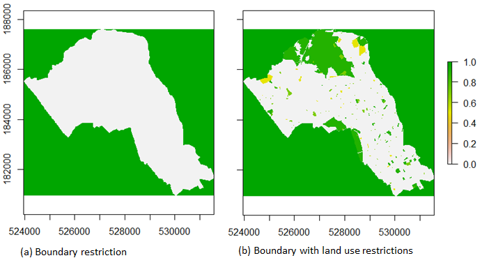
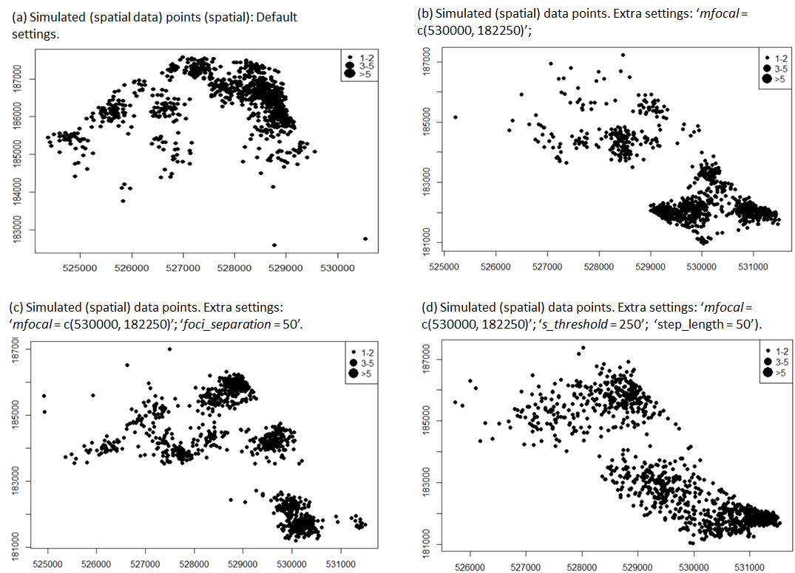
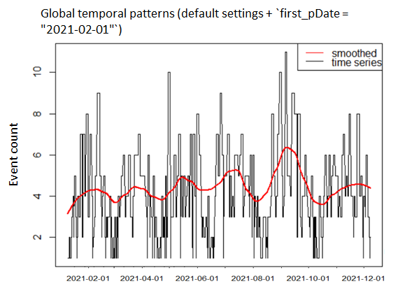
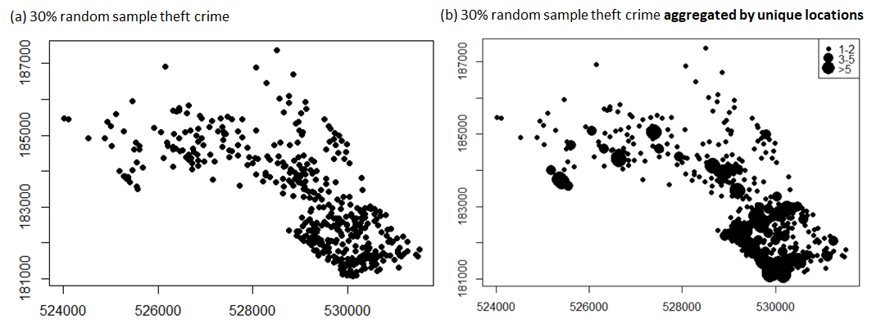
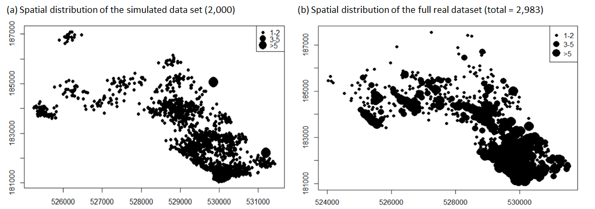
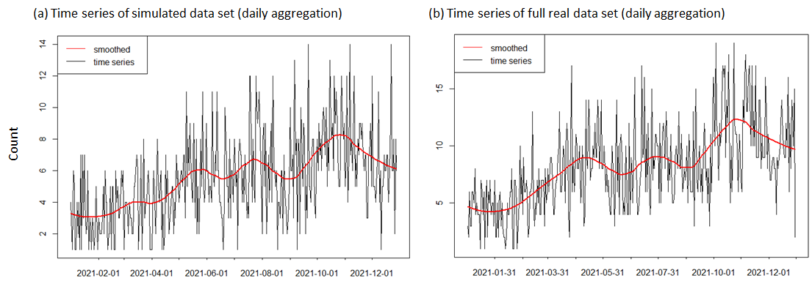

<style type="text/css">

h1.title {
  font-size: 26px;
  line-height: 130%;
  color: Black;
  text-align: center;
}

h2.subtitle {
  font-size: 13px;
  line-height: 120%;
  color: Black;
  text-align: center;
}

h4.author { /* Header 4 - and the author and data headers use this too  */
  font-size: 17px;
  font-family: "Arial";
  color: Black;
  text-align: center;
}
h4.date { /* Header 4 - and the author and data headers use this too  */
  font-size: 17px;
  font-family: "Arial", Times, serif;
  color: Black;
  text-align: center;
}

h4.abstract { /* Header 4 - and the author and data headers use this too  */
  font-size: 10px;
  font-family: "Arial", Times, serif;
  color: black;
  text-align: center;
}

h4.institute{ /* Header 4 - and the author and data headers use this too  */
  font-size: 10px;
  font-family: "Arial", Times, serif;
  color: black;
  text-align: center;
}

body, td {
   font-size: 14px;
}
code.r{
  font-size: 13px;
}
pre {
  font-size: 13px
}
h1 { /* Header 1 */
  font-size: 16px;
  color: DarkBlue;
}
h2 { /* Header 2 */
    font-size: 16px;
  color: DarkBlue;
}
h3 { /* Header 3 */
  font-size: 15px;
  font-family: "Times New Roman", Times, serif;
  color: DarkBlue;

</style>

```{r setup, include = FALSE}
knitr::opts_chunk$set(
  collapse = TRUE,
  comment = "#>"
)
```

```{r functions, include=FALSE}
# A function for captioning and referencing images
fig <- local({
    i <- 0
    ref <- list()
    list(
        cap=function(refName, text) {
            i <<- i + 1
            ref[[refName]] <<- i
            paste("Figure ", i, ": ", text, sep="")
        },
        ref=function(refName) {
            ref[[refName]]
        })
})
```


## ***Introduction***

In many research contexts, access to fine-grained spatiotemporal (ST) point data have been severely restricted due to privacy concerns. The `R-stppSim` package has been designed to address this challenge by presenting a framework that is capable of mimicking a real-life data, through the integration of microsimulation and agent-based techniques, in order to generate new point events in space and time. The framework comprises a set of 'walkers' (agents, objects, persons, etc.) with modifiable movement characteristics, the landscape (spatial components), and the temporal configurations. It is The interaction between these three elements that give rise to new point events, which can be processed, measured, and manipulated for further applications.

The package contains two key functions for synthesizing new datasets; (i) `psim_artif` and (ii) `psim_real`. The `psim_artif` synthesizes point patterns purely from users specifications (`simulation from scratch`). This implies that the simulation does not depend on any existing point data. On the other hand, `psim_real` synthesizes point patterns based on a sample real data set. The latter is particularly applicable to situations where only sparse version of a data set is available for an area. The function learns (or extracts) certain spatial and temporal characteristics of the sample data, and then extrapolates to generate full data set. The potential applications of `stppSim` include generation of offending data sets (crime), disease infection data sets, and foraging point patterns of wild animals. 

## ***Simulation Parameters***

The simulation parameters are in relation to three elements, namely; the '`walkers (agents)`', the `landscape` (spatial), and the `temporal dimension`. The parameters are described as follow: 

### ***Walkers (agents)***

The walkers are defined primarily by the following characteristics:

* ***Origins [`coords`]*** - Walkers emanate from origins. Origins may be distributed randomly across the landscape or exhibit specific spatial concentration. Origins are defined in terms of `xy` coordinates. In criminological application, a human offender can be modelled as a walker emanating from his residence (origin). `Origins` can exhibit two types of concentration: `nucleated` and `dispersed` ([Hornby and Jones, 1991](https://www.google.co.uk/books/edition/An_Introduction_to_Settlement_Geography/DLpzQgAACAAJ?hl=en)). A `nucleated` concentration is one in which all origins concentrate around one focal location, while a `dispersed` concentration has multiple focal locations and the origins can be completely random across the space (see fig. 1). 

```{r figs1, warnings=FALSE, echo=FALSE, out.width="90%", out.height="100%", fig.align = "center", fig.cap=fig$cap("figs1","Type of origin concentration")}
knitr::include_graphics("origins.png")
```

* ***Movement*** - Walkers can move in any direction and have the ability to detect obstructions (restrictions) on their path. The movements are controlled primarily by an in-built `transition matrix` (TM) which defines two operational states, namely; an `exploratory` state (in which a walker is merely exploring the environment) and a `performative` state (in which a walker is doing an action). The stochastic properties of the `TM` ensure variations in the behavioral patterns amongst walkers.
In order to switch from one state to another, a categorical distribution is assigned to the latent state variable $z_{it}$. So, every time step may be assigned to either operational state, independent of the previous state: $$z_t \sim Categorical(\Psi{_{1t}}, \Psi{_{2t}})$$ Such that $\Psi{_{i}}$ = Pr$(z_t = i)$, where $\Psi{_{i}}$ is the fixed probability of being in state $i$ at time $t$, and $\sum_{i=1}^{z}\Psi{_{i}}=1$

* ***Spatial perception [`s_threshold`]*** - Perception range of a walker at a given location. The parameter `s_threshold` is generally updated as a walker moves to a new location. A natural method for choosing this parameter is to plot out the data, choose the estimate that is most in accordance with one's prior ideas about the `s_threshold` value. For many applications this approach will be perfectly satisfactory. For `psim_artif`, a user will be expected to define a value, but for `psim_real`, the optimal [s_threshold value](https://www.taylorfrancis.com/books/mono/10.1201/9781315140919/density-estimation-statistics-data-analysis-silverman) may be estimated based on the sample data set.

* ***Steps [`step_length`]*** - The maximum step taken by a walker from one point location to the next. This defines the speed of a walker across the space. The `step_length` should be carefully defined, particularly, when movements are restricted along narrow paths, such as a route network. In this case, the value must be smaller than the width of the paths. 

* ***Proportional ratios [`p_ratio`]*** - Defines the spatial concentration of events being generated by the walkers. Defined as the percentage of total events emanating from a small number of the most active origins. For example, a `20:80` proportional ratios implies that 20% of origins (walkers) would generate 80% of the total point events.

### ***Landscape (spatial)***

The followings are the key properties of a landscape:

* ***Boundary [`poly`]*** - A landscape is bounded - defined by a polygon shapefile (`poly`) or by the spatial extent of the sample point data.

* ***Restrictions [`restriction_feat`]*** - Features constituting obstructions. Comprising two parts: (i) Areas outside the boundary (`poly`) with maximum restriction value of `1`. That is, walkers can not step outside the boundary. (ii) Features within the boundary serving as obstructions to movement, e.g., certain land use type or  land features, such as a fenced place and hills. Typically, to generate a restriction map, two steps are involved. Using the example of boundary shapefile of Camden area of London (UK), a restriction map can be generated as follows:

`Step 1`: Generate boundary restriction

```{r eval=FALSE, echo=TRUE}
#load shapefile data
load(file = system.file("extdata", "camden.rda", package="stppSim"))
#extract boundary shapefile
boundary = camden$boundary # get boundary
#compute the restriction map
restrct_map <- space_restriction(shp = boundary,res = 20, binary = TRUE)
#plot the restriction map
plot(restrct_map)
```

`Step 2`: Setting the `restrct_map` above as the `basemap`, and then stack the land use features to define the restrictions within the area,

```{r eval=FALSE, echo=TRUE}
# get landuse data
landuse = camden$landuse 

#compute the restriction map
full_restrct_map <- space_restriction(shp = landuse, 
     baseMap = restrct_map, res = 20, field = "restrVal", background = 1)

#plot the restriction map
plot(full_restrct_map)
```

```{r figs2, echo=FALSE, out.width="100%", out.height="100%", fig.align = "center", fig.cap=fig$cap("figs2","Restriction map")}

```

From figure 2, the land use feature has three classes, with each class having it's own restriction value {e.g., `Leisure` (0.5); `Sports` (0.7); and `Green` (0.9)}, 


* ***Focal points [`n_foci`]*** - Locations (origins) of relatively higher importance. Usually present more opportunities (to event occurrences). This is only specified when using `psim_artif`. A user will typically specify the number of focal points to simulate. In the context of urban landscape configuration, a focal point is synonymous to a `city/town centre`. The major focal point (location) within a city (if exist) can also be specified, using an additional parameter `mfocal`.  The default value of `mfocal` is `NULL`. Also, a parameter `foci separation` allows a user to specify the proximity of the focal points to one another (values range from 1 to 100), with `1` and `100` being `highest` and `lowest` proximities, respectively. 

### ***Temporal dimension***

The following parameters define the temporal dimension:

* ***Long-term trend [`trend`]*** - Defines the long-term direction of the time series to be simulated. The can be `stable`, `rising` or `falling`. When `rising` or `falling`, an additional `slope` argument can be used to specify whether the trend slope is `gentle` or `steep`. Also, only applies to simulation from scratch. 

* ***Seasonal patterns [`first_pDate`]*** - Defines the medium-term fluctuations of the total events over time. This is controlled by specifying the first seasonal peak point of the time series. A  `90` day first peak implies a seasonal cycle of `180` days.

```{r figs3, echo=FALSE, out.width="70%", out.height="50%", fig.align = "center", fig.cap=fig$cap("figs3", "Global trends and patterns")}
knitr::include_graphics("trend.png")
```

Figure 3 shows expected seasonal patterns based on different values of `first_pDate`, starting with 90 days, and then increasing the value successively by one month. The number of seasonal cycles decreases with later `first_pDate` values. Both the long-term trend and the seasonal patterns are learned when simulating using `psim_real`.

* ***time bin*** - Time to reset all walkers. Typically 1 day. 

## ***Installation of `stppSim`***

From `R` console, type:

```{r eval=FALSE, message=FALSE, warning=FALSE}
#To install from  `CRAN`
install.packages("stppSim")

#To install the `developmental version`, type:
remotes::install_github("MAnalytics/stppSim")
#Note: `remotes` is an extra package that needed to be installed prior to the running of this code.
```

Now, to load the package, 

```{r eval=FALSE, message=FALSE, warning=FALSE}
library(stppSim)
```


## ***Simulating `stpp` from scratch***

Three key arguments required are: `n_events` - **the number of points to simulate**, `start_date` - the start date of the time series, and `poly` - **the polygon shapefile representing the boundary of the study area** within which point patterns are to be simulated. For the former, it is recommended that a vector of values is provided, rather than a single value. For example, `n_events = c(200, 500, 1000, 2000)`. The output is generated as a list comprising the separate data frame for each value. Besides, the length of `n_events` has little of no effects on the processing time.   

### Example 

Given the boundary shapefile of Camden Borough of London (embedded in the package), the `stpp` can be generated as follows: 

```{r eval=FALSE, echo = TRUE, message=FALSE, warning=FALSE}

#load the data
load(file = system.file("extdata", "camden.rda",
                        package="stppSim"))

boundary <- camden$boundary # get boundary data

#specifying data sizes
pt_sizes = c(200, 1000, 2000)

#simulate data
artif_stpp <- psim_artif(n_events=pt_sizes, start_date = "2021-01-01",
  poly=boundary, n_origin=50, resistance_feat = NULL,
  field = "restrVal",
  n_foci=5, foci_separation = 10, mfocal = NULL,
  conc_type = "dispersed",
  p_ratio = 20, s_threshold = 50, step_length = 20,
  trend = "stable", first_pDate=NULL,
  slope = NULL,show.plot=FALSE, show.data=FALSE)

```

The processing time on an Intel Core i7-7500CPU @ 2.70GHz, 16.0GB RAM PC is `3.5 minutes`. The processing time is increased to `30.2` minutes, if the argument `resistance_feat = camden$landuse`. 

To retrieve the result of any `n_events`, simply type the object name with the value index. For example to retrieve the result based on `n_events = 1000`, type: 

```{r eval=FALSE}
stpp_1000 <- artif_stpp[[2]]
``` 

* Spatial Patterns

The spatial patterns and clustering of events can be controlled by manipulating the arguments that control the properties of the spatial components (e.g., `resistance_feat`, `n_origin`, `mfocal`, `foci_separation`, `n_foci`, etc.) and the ones that control the properties of the walkers (e.g. `step_length`, `s_threshold`, `p_ratio`). Specifically, in order to add a focal location to the simulation (i.e. `mfocal` - see explanation above), use the `make_grids` function to generate an interactive map from which the `xy` coordinates of every location in the map can be displayed/extracted. The interactive map includes an `OpenStreetMap` that allows a user to identify places more easily.

***Figure 4*** is the spatial point patterns (`spp`) of `n_events = 1000` at varying parameter settings. ***Note:*** the spatial pattern is likely to change each time the code is re-run, owing to the random elements in the function. ***Figure 4a*** is the result when all default arguments are used (as in the code above). ***Figure 4b*** is the result when the following extra arguments are applied, namely; `resistance_feat = camden$landuse` and `mfocal = c(530000, 182250)` - the first argument limits the amount of events simulated within the land use (restriction) features, and the second argument ensures that the spatial concentration of origins are around a focal point (point indicated as red dot on the map). ***Figure 4c*** is the result when, in addition to applying the `resistance_feat` and `mfocal` (as above), the `foci_separation = 50` - this additional argument ensures that the origins are moderately far from each another. Lastly, ***Figure 4d*** is the result when, in addition to setting the `mfocal` (as above), the `s_threshold` and `step_length` are set as equal to `250` and `50`, respectively - these additional settings is to ensure that points are well-spread out from their respective  origins. 


```{r figs4, echo=FALSE, out.width="100%", out.height="100%", fig.align = "center", fig.cap=fig$cap("figs4", "Simulated spatial point patterns of Camden")}

```
In the above figures, notice that points that fall on exactly the same unique location are aggregated and symbolize to reflect the count. 

* Temporal Patterns

Since the arguments that control the global temporal patterns (i.e. `trend`, `first_pDate`, and `slope`) in each of the simulation above are constant, then we expect the temporal patterns to be very similar. ***Figure 5a-d*** are the global temporal patterns of ***Figure 4a***, ***4b***, ***4c***, and ***4d***, respectively.

```{r figs5, echo=FALSE, out.width="100%", out.height="100%", fig.align = "center", fig.cap=fig$cap("figs5","Simulated global trends and patterns (gtp)")}
knitr::include_graphics("temporalscratch.png")
```

If, for example, we set `first_pDate = "2021-02-01"` (i.e., one month after the start date of the series) and re-run the simulation, assuming we use default parameters, then the resulting global temporal patterns is shown in ***Figure 6***. 

```{r figs6, echo=FALSE, out.width="50%", out.height="50%", fig.align = "center", fig.cap=fig$cap("figs6", "Gtp with an earlier first seasonal peak")}

```


## ***Simulating `stpp` from sample real dataset***

The two key parameters here include, `n_events` - **the number of points to simulate**, and `ppt` - the **sample real data**. As stated above, it is recommended to set a vector of values as equal to `n_events`. The sample data set should have clear `x`, `y` and `t` fields (see details in the package`manual`). 

### Example 

Let us extract 30% random sample from the `theft crimes` data of Camden, and then use the sample to synthesize `full` data set. 

```{r eval=FALSE, message=FALSE, warning=FALSE}

#load Camden crimes
data(camden_crimes)

#extract 'theft' crime
theft <- camden_crimes %>%
  filter(type == "Theft")

#print the total no. of records
nrow(theft)
```

```{r eval=FALSE, message=FALSE, warning=FALSE}

#specify the proportion of total records to extract
sample_size <- 0.3 #i.e., 30%

set.seed(1000)
dat_sample <- theft[sample(1:nrow(theft),
  round((sample_size * nrow(theft)), digits=0),
  replace=FALSE),1:3]

#print the number of records in the sample data
nrow(dat_sample)
```

It is good practice to preview data set before any analysis. Let us check the spatial distribution of the sample data, in order to guide us in defining certain parameters, such as `n_origin` and `s_threshold`.

Below code plots the point data based on their `xy` location:

```{r eval=FALSE, message=FALSE, warning=FALSE}

plot(dat_sample$x, dat_sample$y,
    pch = 16,
     cex = 1,
     main = "Sample data at unique locations",
     xlab = "x",
     ylab = "y")
```

***Figure 7a*** is the point patterns of the sample data sets. In practice, many crime data sets are aggregated to certain nearest snap points (e.g. centroids of square grids). Therefore, in order to accurately reveal the spatial distribution and clustering of the crime data, there is a need to aggregate the points by unique locations. Thus, the following code aggregate points by unique locations and then generates the point patterns as shown in ***Figure 7b***:

```{r eval=FALSE, message=FALSE, warning=FALSE}
agg_sample <- dat_sample %>%
  mutate(y = round(y, digits = 0))%>%
  mutate(x = round(x, digits = 0))%>%
  group_by(x, y) %>%
  summarise(n=n()) %>% 
  mutate(size = as.numeric(if_else((n >= 1 & n <= 2), paste("1"),
                        if_else((n>=3 & n <=5), paste("2"), paste("2.5")))))

dev.new()
itvl <- c(1, 2, 2.5)
plot(agg_sample$x, agg_sample$y,
     pch = 16,
     cex=findInterval(agg_sample$size, itvl),
     main = "Sample data aggregated at unique location",
     xlab = "x",
     ylab = "y")
legend("topright", legend=c("1-2","3-5", ">5"), pt.cex=itvl, pch=16)

#hist(agg_sample$size)
```


```{r figs7, echo=FALSE, out.width="100%", out.height="100%", fig.align = "center", fig.cap=fig$cap("figs7", "Sample real data (a) unaggregated and (b) aggregated by locations")}

```

From ***Figure 7b***, it can be seen that the southern part of Camden has the highest concentration of theft crimes. The spatial distribution of sample data points can guide a user in selecting the most appropriate spatial parameters. For example, to ensure a narrower spread of the points, a user can either set `n_origin` or {`s_threshold` and `step_length`} as small values. 

In general, to guide the selection of appropriate spatial parameters for any new study area, a user might needs to understand the relative size of the new study area compared to Camden (This is discussed in details below).  

Now, simulating the point data:

```{r eval=FALSE, message=FALSE, warning=FALSE}

#As the actual size of any real (full) dataset
#would not be known, therefore we will assume
#`n_events` to be `2000`. In practice, a user can 
#infer `n_events` from several other sources, such 
#as other available full data sets, or population data, 
#etc.

#Simulate
sim_fullData <- psim_real(n_events=2000, ppt=dat_sample,
  start_date = NULL, poly = NULL, s_threshold = NULL,
  step_length = 20, n_origin=50, restriction_feat=landuse, 
  field=NA, p_ratio=20, crsys = "EPSG:27700")

```

```{r eval=FALSE, echo=FALSE, warning=FALSE}
#read
load(file="C:/Users/monsu/Documents/GitHub/stppSim backup/simulation_for_vignette/sim_fullData.rda")
sim_d <- sim_fullData[[1]]

```

Summarising the results:

```{r eval=FALSE, echo=TRUE, warning=FALSE}
summary(sim_fullData[[1]])
```


### ***Comparing simulated data and full real data***

We will employ both `visual` and `statistical` approaches to compare the spatial and temporal patterns of the simulated data and the full real data (i.e., 100% data size). 

* ***Visual approach***

The `visual` approach involves plotting the spatial distribution of points across the space for spatial comparison, and plotting the time series of the data for temporal comparison. ***Figure 8a*** and ***8b*** are the point distribution of the simulated data and the full real data set, respectively, while Figure 9a and 9b are their respective time series plot.

```{r figs8, echo=FALSE, out.width="100%", out.height="100%", fig.align = "center", fig.cap=fig$cap("figs8", "Setting an earlier first seasonal peak")}

```

Two things are important to note in ***Figure 8***, namely; the `total number of points` and the `clustering of points`. First, we intentionally set `n_events = 2000`, in order to mimicking a real life scenario, where we do not know the actual value. Second, the real data (***Figure 8b***) shows much higher clustering of points at unique locations; this reflects the crime recording practice in which points are snapped to reference locations nearest to incidents. However, our simulation (***Figure 8a***) does not attempts to aggregate points to any reference locations.

```{r figs9, echo=FALSE, out.width="100%", out.height="100%", fig.align = "center", fig.cap=fig$cap("figs9", "Global temporal pattern of (a) simulated and (b) full real data set ")}

```

It can be seen from ***Figure 9*** that the temporal patterns of both the simulated and the real data appear very similar. They both have similar seasonal patterns (red lines), with the trend rising steadily over time.

* ***Statistical approach***

In order to conduct a statistical comparison of the simulated and the real data set, in spatial and temporal dimensions, we utilize [Pearson's Coefficient](https://www.statisticshowto.com/probability-and-statistics/correlation-coefficient-formula/). For the spatial, we aggregated the data sets to a regular square grid system, matched the counts by grids ids, and calculated the correlation measure. The analysis was conducted using three different grid sizes (i.e. `150sq.mts`, `250sq.mts`, and `400sq.mts`) to assess how the correlation changes with spatial scale.

For the temporal, we also utilize three different scales, namely; `daily`, `weekly`, and `monthly`. ***Table 1*** shows the correlation measures indicating the similarities between the two data sets.

```{r table1, results='asis', echo=FALSE, tidy.opts=list(width.cutoff=50)}
table <- data.frame(cbind(Dimension = c("Spatial", "","","Temporal","",""),
      Scale_sq.mts = c(150, 250, 400, "Daily", "Weekly", "Monthly"),
      Corr.Coeff = c(.50, .62, .78, .34, .78, .93)))

knitr::kable(table, caption = "Table 1. `Correlation between simulated and real data sets`", row.names=FALSE, align=c("l", "r", "r"))
```

There are strong similarities between the simulated and the real data sets, in both spatial and temporal dimensions, except at the `daily` temporal scale in which the similarity is weak. This is however expected given the level of randomness at such a finer scale, coupled with the fact that the daily stamp of the 
real data set was randomly generated (see the manual on the details of the `police.uk` data set). As the aggregation increases, either in the spatial or temporal dimension, the data tends to be more similar, with correlation coefficients of `.78` and `.93`, at the highest spatial and temporal scales, respectively. 

## ***Setting simulation parameters for different study areas***

All the parameters (arguments) as used in this vignette are expected to produce similar effects for any study area, except for three of the parameters that control the spatial distributions of the simulated points. These include `n_origin`, `s_threshold` and `step_length`. A user will need to set the appropriate values for these parameters in order to produce a reasonably distributed point patterns across the space. As the size of the study area increases or decreases, we expect these three arguments to "proportionally" scale up or scale down, respectively. ***Note***: We recommend that a user only scale either {`n_origin`} or {`s_threshold` and `step_length`} to control the spatial dimension. 

As a result of the above challenge, we provide the function `compare_areas()` to allow a user to compare the relative size of any two areas. Typically, one of the areas would be one in which the appropriate simulation parameters are already established, such as `Camden` (in this vignette). By inputing a second polygon shapefile in the function, a factor or value is generated, which compares the sizes of the two areas. This factor should be used to multiple the above stated parameters for the new area. For example, if `Camden` is `3 times` smaller than the new area, then we multiply either {`n_origin`} or {`s_threshold` and `step_length`} by `3` for the simulation. You use divide if `Camden` is bigger. Computationally, using {`s_threshold` and `step_length`} is a better option.

We can demonstrate the utility of `compare_areas()` function by comparing `Birmingham` area of UK with `Camden` area, as follows:

```{r eval=FALSE, echo=TRUE, warning=FALSE}

#load 'area1' object - boundary of Camden, UK
load(file = system.file("extdata", "camden.rda",
                        package="stppSim"))

camden_boundary = camden$boundary

#load 'area2' - boundary of Birmingham, UK
load(file = system.file("extdata", "birmingham_boundary.rda",
                        package="stppSim"))

#run the comparison
output <- compare_areas(area1 = camden_boundary,
              area2 = birmingham_boundary, display_output = FALSE)

```

The comparison (and the factor) can be printed as follows:

```{r eval=FALSE, echo=FALSE, warning=FALSE}
output$comparison
```

The above code returns the string `#-----'area2' is 12.3 times bigger than 'area1'-----#`. 

Based on the above, then multiply {`n_origin`} used for Camden simulation by `12.3` or each of {`s_threshold` and `step_length`} used for Camden simulation by `12.3`. Then, set the new values in the simulation function and run. 

## ***Discussion***

This vignette has demonstrated the utility of the two key simulation functions of the `stppSim` package: (i) the `psim_artif` - for generating `stpp` from scratch and (ii) `psim_real` - for generating `stpp` from a sample real data set. The vignette demonstrated how to modify the parameters in order to control the resulting spatial and dimension characteristics of the data. However, these parameters should be modified in accordance with the subject under study. The package has a wide potential areas of applications, including the study of human offending behaviours and crime, the foraging characteristics of wild animals and their scores, and thirdly, the study of disease carriers and infections. We will continue to update the package for wider application.   

We encourage users to report any bugs encountered while using the package so that they can be fixed immediately. Welcome contributions to this package which will be acknowledged accordingly. 
